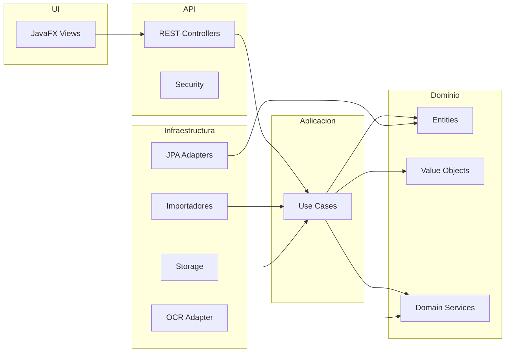

```mermaid
graph LR
    subgraph Dominio
        A[Entities]
        B[Value Objects]
        C[Domain Services]
    end
    subgraph Aplicacion
        D[Use Cases]
    end
    subgraph Infraestructura
        E[JPA Adapters]
        F[OCR Adapter]
        G[Importadores]
        H[Storage]
    end
    subgraph API
        I[REST Controllers]
        J[Security]
    end
    subgraph UI
        K[JavaFX Views]
    end

    D --> A
    D --> B
    D --> C
    I --> D
    K --> I
    E --> A
    F --> C
    G --> D
    H --> D
```
